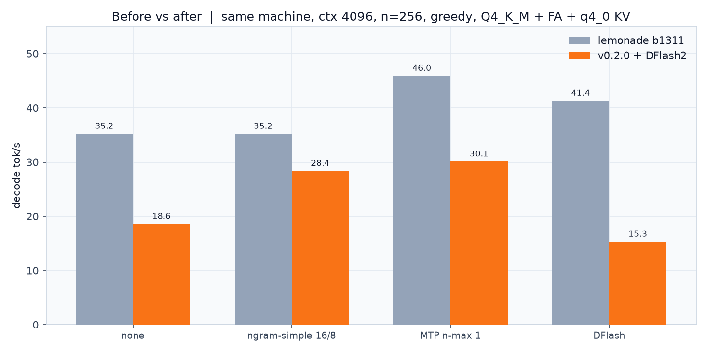
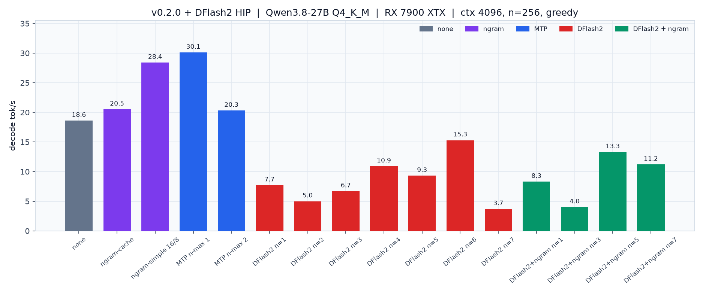
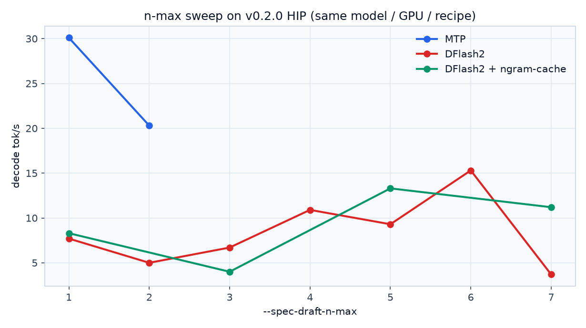
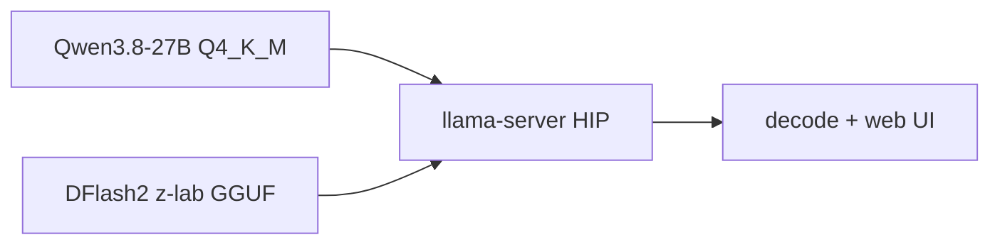

# llamacpp-rocm-dflash2

llama.cpp **v0.2.0** + [DFlash2](https://github.com/ggml-org/llama.cpp/pull/27342), HIP on Arch ROCm. Optional Ubuntu zips bundle TheRock the same way lemonade does.

[](https://github.com/maci0/llamacpp-rocm-dflash2/releases)
[](https://rocm.docs.amd.com)
[](https://github.com/ggml-org/llama.cpp/pull/27342)

```text
--spec-type draft-dflash,ngram-cache --spec-draft-n-max 5
```

## Before vs after

Same box (RX 7900 XTX, Qwen3.8-27B Q4_K_M, flash-attn, q4_0 KV, ctx 4096, n=256, greedy). Left: lemonade **b1311**. Right: this **v0.2.0 + DFlash2** HIP build.



| | lemonade b1311 | this build |
| --- | ---: | ---: |
| none | 35.2 t/s | 18.6 t/s |
| ngram-simple 16/8 | 35.2 t/s | 28.4 t/s |
| **MTP n-max 1** | **46.0 t/s** | **30.1 t/s** |
| DFlash | 41.4 t/s (v1 bootstrap) | 15.3 t/s (z-lab v2, best n-max) |

MTP n-max 1 still wins on both engines. DFlash2 runs here; it does not beat MTP on this GPU/quant yet. Full tables and notes: [docs/bench.md](docs/bench.md).

## Speculative sweep (this build)





## Install

**Arch / CachyOS** (needs `hip-runtime-amd hipblas rocblas`):

```bash
sudo pacman -U https://github.com/maci0/llamacpp-rocm-dflash2/releases/download/v0.2.0-2/llama.cpp-rocm-dflash2-0.2.0-2-x86_64.pkg.tar.zst
```

From a clone: `paru -Bi .` or `makepkg -si`.

Default `AMDGPU_TARGETS=all` (every lemonade family ISA in one fat binary). Thinner: `AMDGPU_TARGETS=gfx110X makepkg -si`.

**Ubuntu lemonade-style zips** (TheRock HIP inside the zip, one archive per family): `scripts/build-lemonade-docker.sh` on Ubuntu 24.04.

## Run

```bash
unset LD_LIBRARY_PATH
export HIP_VISIBLE_DEVICES=0
llama-server \
  -m Qwen3.8-27B-Q4_K_M.gguf \
  -md Qwen3.8-27B-DFlash2-z-lab-Q8_0.gguf \
  -c 4096 -ngl 99 -fa on -ctk q4_0 -ctv q4_0 \
  -b 4096 -ub 2048 -t 16 \
  --spec-type draft-dflash,ngram-cache --spec-draft-n-max 5 \
  --host 0.0.0.0 --port 8080
```

Self-MTP (no extra draft): `--spec-type draft-mtp --spec-draft-n-max 1`.

The GGUF architecture selects DFlash2. There is no `draft-dflash2` flag.



## GPU targets

| `AMDGPU_TARGETS` | HIP arches |
| --- | --- |
| `all` (default) | gfx1030/31/32/34, gfx1100/01/02/03, gfx1150/51, gfx1200/01, gfx90a, gfx908 |
| `gfx110X` | gfx1100;gfx1101;gfx1102;gfx1103 |
| `gfx103X` / `gfx120X` | family lists |
| `gfx1150` `gfx1151` `gfx90a` `gfx908` | as written |

## SPEED-Bench

```bash
SPEED_BENCH_LIMIT=16 ./scripts/run-speed-bench.sh
```

Uses [nvidia/SPEED-Bench](https://huggingface.co/datasets/nvidia/SPEED-Bench) qualitative split against `llama-server`.

## What this is not

lemonade **b1311** (llama.cpp `9558fa4`). Upstream **b10599**. This is the **v0.2.0** tag plus PR 27342 until DFlash2 lands in a stable tag.
