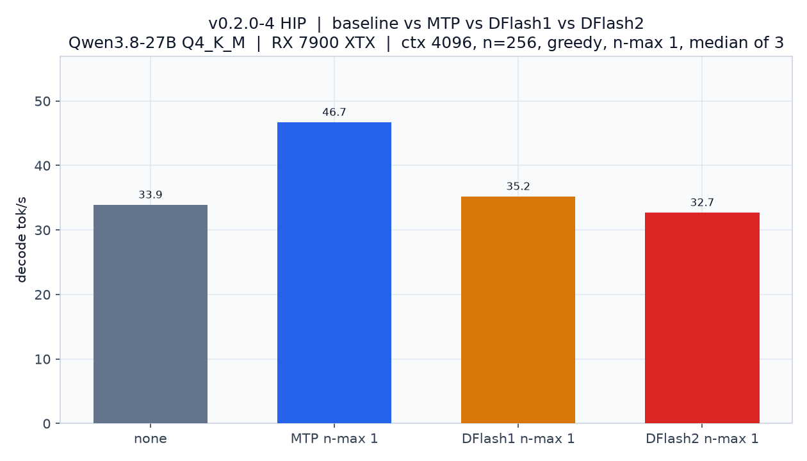
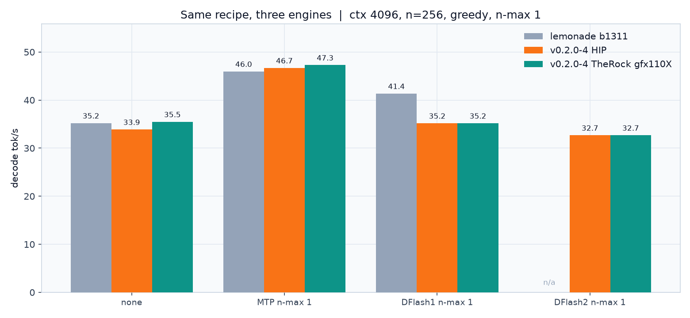
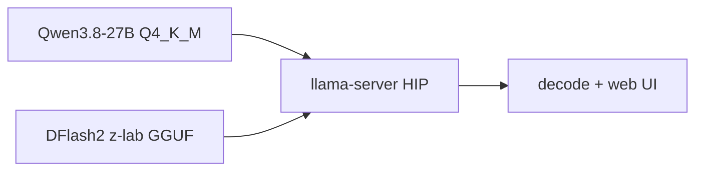

# llamacpp-rocm-dflash2

llama.cpp **v0.2.0** + [DFlash2](https://github.com/ggml-org/llama.cpp/pull/27342), HIP on Arch ROCm. Optional Ubuntu zips bundle TheRock the same way lemonade does.

[](https://github.com/maci0/llamacpp-rocm-dflash2/releases)
[](https://rocm.docs.amd.com)
[](https://github.com/ggml-org/llama.cpp/pull/27342)

```text
--spec-type draft-dflash --spec-draft-n-max 4
```

## Baseline vs MTP vs DFlash vs DFlash2

Same box (RX 7900 XTX, gfx1100, 24 GB, Qwen3.8-27B Q4_K_M, flash-attn, q4_0 KV, ctx 4096, n=256, greedy). Spec paths use `--spec-draft-n-max 1`. This-build numbers are the median of 3 reps on **v0.2.0-4** (PR 27342 `@ d1a522fc`).





| | lemonade b1311 | this build | vs this baseline |
| --- | ---: | ---: | ---: |
| none | 35.2 t/s | 33.9 t/s | 1.00x |
| **MTP n-max 1** | **46.0 t/s** | **46.7 t/s** | **1.38x** |
| DFlash1 bootstrap n-max 1 | 41.4 t/s | 35.2 t/s | 1.04x |
| DFlash2 z-lab n-max 1 | n/a | 32.7 t/s | 0.96x |

MTP still wins. Quiet-CPU HIP now matches lemonade on none and slightly beats it on MTP. Neither DFlash draft beats MTP at n-max 1. DFlash2 n-max 1 is a hair under this baseline; the n-max sweep peaks at n-max 4 (41.1 t/s, single shot). Full tables: [docs/bench.md](docs/bench.md).

## Speculative sweep (this build)

Single-shot n-max sweep on the same v0.2.0-4 binary, quiet CPU. DFlash2's best point is n-max 4 (41.1 t/s). MTP n-max 2 is 47.4 t/s. Adding ngram-cache on top of DFlash2 does not help.


## Install

**Arch / CachyOS** (needs `hip-runtime-amd hipblas rocblas`):

```bash
sudo pacman -U https://github.com/maci0/llamacpp-rocm-dflash2/releases/download/v0.2.0-5/llama.cpp-rocm-dflash2-0.2.0-5-x86_64.pkg.tar.zst
```

From a clone: `paru -Bi .` or `makepkg -si`.

Default `AMDGPU_TARGETS=all` (every lemonade family ISA in one fat binary). Thinner: `AMDGPU_TARGETS=gfx110X makepkg -si`.

**Prefix build, no sudo** (CachyOS / Arch, `/opt/rocm` already installed). gfx1150-only is the 890M path:

```bash
AMDGPU_TARGETS=gfx1150 PREFIX=$HOME/llamacpp-dflash2 ./scripts/build-prefix.sh
. ~/llamacpp-dflash2/env.sh
```

890M (Strix Point) recipe + benches: [docs/890m.md](docs/890m.md).

**Ubuntu lemonade-style zips** (TheRock HIP inside the zip, one archive per family): `LEMONADE_FAMILIES=gfx110X ./scripts/build-lemonade-docker.sh`. Run from the unzipped folder with `unset LD_LIBRARY_PATH`; do not point at `/opt/rocm`. On this 7900 XTX the gfx110X zip matches lemonade on none and slightly beats it on MTP. Numbers: [docs/bench.md](docs/bench.md).

## Run

```bash
unset LD_LIBRARY_PATH
export HIP_VISIBLE_DEVICES=0
llama-server \
  -m Qwen3.8-27B-Q4_K_M.gguf \
  -md Qwen3.8-27B-DFlash2-z-lab-Q8_0.gguf \
  -c 4096 -ngl 99 -fa on -ctk q4_0 -ctv q4_0 \
  -b 4096 -ub 2048 -t 16 \
  --spec-type draft-dflash --spec-draft-n-max 4 \
  --host 0.0.0.0 --port 8080
```

Fastest on this GPU: `--spec-type draft-mtp --spec-draft-n-max 1` (or 2). `ngram-cache` stacked on DFlash2 did not help.

The GGUF architecture selects DFlash2. There is no `draft-dflash2` flag.



## GPU targets

| `AMDGPU_TARGETS` | HIP arches |
| --- | --- |
| `all` (default) | gfx1030/31/32/34, gfx1100/01/02/03, gfx1150/51, gfx1200/01, gfx90a, gfx908 |
| `gfx110X` | gfx1100;gfx1101;gfx1102;gfx1103 |
| `gfx103X` / `gfx120X` | family lists |
| `gfx1150` `gfx1151` `gfx90a` `gfx908` | as written |

Verified on this tree: **gfx1100** (RX 7900 XTX, [docs/bench.md](docs/bench.md)) and **gfx1150** (Radeon 890M / Ryzen AI 9 HX 370, [docs/890m.md](docs/890m.md)). On the 890M, lemonade `b10469`/`b1317` cannot load DFlash2 GGUFs; the prefix build above does (`block_size=8`). MTP n-max 1 is still the fastest *3-rep* path on that APU (~6.1 t/s vs ~4.4 none).

## SPEED-Bench

Not re-run on v0.2.0-4.

```bash
SPEED_BENCH_LIMIT=16 ./scripts/run-speed-bench.sh
```

[nvidia/SPEED-Bench](https://huggingface.co/datasets/nvidia/SPEED-Bench) qualitative split against `llama-server`. DFlash2 uses `--spec-draft-n-max 4`.

## What this is not

lemonade **b1311** (llama.cpp `9558fa4`). Upstream **b10599**. This is the **v0.2.0** tag plus PR 27342 (`d1a522fc`) until DFlash2 lands in a stable tag.
