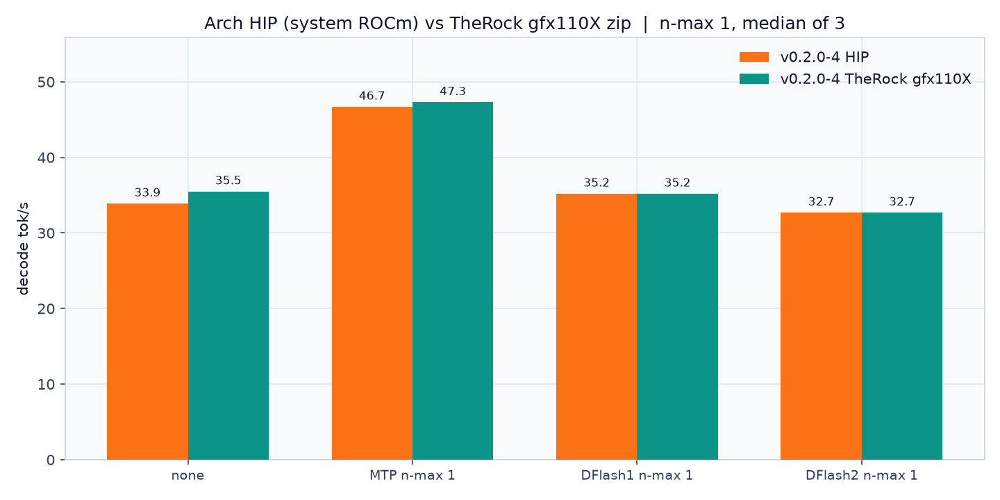

# Benchmarks

Hardware: RX 7900 XTX (gfx1100, 24 GB), Ryzen 9 9950X, ROCm 7.2.4.
Model: `Qwen3.8-27B-Q4_K_M.gguf`. Recipe flags: `-ngl 99 -fa on -ctk q4_0 -ctv q4_0 -b 4096 -ub 2048 -t 16`, ctx 4096, n=256, greedy.

**lemonade b1311** is llama.cpp `9558fa4`, HIP gfx110X zip, from the qwenspeed p5/p5b single-shot sweep.
**this build** is llama.cpp **v0.2.0-4** plus [PR 27342](https://github.com/ggml-org/llama.cpp/pull/27342) `@ d1a522fc` (DFlash2), Arch HIP, all-ISA fat binary.

Same prompt, same GPU, same quant. Not a 256K-ctx rerun.

## Baseline vs MTP vs DFlash1 vs DFlash2

n-max 1 on every spec path. This-build figures are the median of 3 `llama-cli` reps (load ~2).

Drafts:

- DFlash1: `Qwen3.8-27B-DFlash-bootstrap-Q8_0.gguf`
- DFlash2: `Qwen3.8-27B-DFlash2-z-lab-Q8_0.gguf` (z-lab, converted here)


| config | lemonade b1311 | this build median | this reps | vs this baseline |
| --- | ---: | ---: | --- | ---: |
| none | 35.2 | 33.9 | 33.6, 34.1, 33.9 | 1.00x |
| MTP n-max 1 | **46.0** | **46.7** | 46.0, 46.7, 46.7 | **1.38x** |
| DFlash1 n-max 1 | 41.4 | 35.2 | 33.7, 35.8, 35.2 | 1.04x |
| DFlash2 n-max 1 | n/a | 32.7 | 21.1, 32.7, 34.5 | 0.96x |

MTP is the fastest speculative path on both engines. Quiet-CPU HIP matches lemonade on none (33.9 vs 35.2) and slightly beats lemonade MTP (46.7 vs 46.0). DFlash1 still beats DFlash2 at n-max 1; neither catches MTP. DFlash2's first rep (21.1) is a cold start; the other two sit at 32.7 and 34.5. Prompt-eval t/s drops when a draft GGUF is loaded (extra HIP graph / weights).

Lemonade also ran ngram-simple 16/8 (35.2 t/s). This sweep's matching row is 33.6 t/s. DFlash2 is HIP-only, so it is not on this chart.


Raw: [bench/fourway.csv](bench/fourway.csv), [bench/fourway_reps.csv](bench/fourway_reps.csv), [bench/fourway_engines.csv](bench/fourway_engines.csv), [bench/before.csv](bench/before.csv). Repro: `./scripts/fourway.sh`.

## TheRock Ubuntu zip (bundled HIP)

Same v0.2.0-4 tree, built in Ubuntu 24.04 Docker with TheRock `gfx110X-all-7.15.0a20260728` next to the binaries. `ldd` does not touch `/opt/rocm`. Four-way is again 3-rep median, n-max 1, quiet-ish CPU (load ~4.6).

| config | lemonade b1311 | Arch HIP (system ROCm) | TheRock gfx110X zip |
| --- | ---: | ---: | ---: |
| none | 35.2 | 33.9 | **35.5** |
| MTP n-max 1 | 46.0 | 46.7 | **47.3** |
| DFlash1 n-max 1 | **41.4** | 35.2 | 35.2 |
| DFlash2 n-max 1 | n/a | 32.7 | 32.7 |



TheRock HIP is the closer match to lemonade on greedy decode (35.5 vs 35.2). MTP is a bit ahead of both. DFlash1/DFlash2 medians match Arch HIP; lemonade's DFlash1 (41.4) is still the outlier. Prompt-eval on TheRock none is 208 t/s vs Arch HIP 236 t/s (this zip's CPU backend was generic; `CMAKE_SYSTEM_PROCESSOR=x86_64` is now set for the next Docker build).

One-shot DFlash2 `--spec-draft-n-max 4` on this zip: 40.5 t/s (Arch HIP sweep: 41.1 t/s).

Repro:

```bash
LEMONADE_FAMILIES=gfx110X ./scripts/build-lemonade-docker.sh
DIST=dist/lemonade/llama-v0.2.0-ubuntu24.04-rocm-gfx110X-x64 \
  ENGINE='v0.2.0-4 TheRock gfx110X' TAG=therock ./scripts/fourway.sh
```

Raw: [bench/fourway_therock.csv](bench/fourway_therock.csv), [bench/fourway_therock_reps.csv](bench/fourway_therock_reps.csv).

## n-max sweep

Single-shot on the same v0.2.0-4 binary, quiet CPU. Four-way numbers above are 3-rep medians; this sweep is one shot, so MTP n-max 1 here (43.3) is a bit below the four-way median (46.7).

DFlash2 peaks at n-max 4 (41.1 t/s). MTP n-max 2 is 47.4 t/s. `draft-dflash,ngram-cache` is slower than DFlash2 alone at every n tried.


| config | decode t/s |
| --- | ---: |
| none | 33.8 |
| ngram-simple 16/8 | 33.6 |
| ngram-cache | 26.8 |
| MTP n-max 1 | 43.3 |
| MTP n-max 2 | **47.4** |
| DFlash2 n-max 1 | 28.9 |
| DFlash2 n-max 2 | 28.3 |
| DFlash2 n-max 3 | 34.2 |
| DFlash2 n-max 4 | **41.1** |
| DFlash2 n-max 5 | 30.2 |
| DFlash2 n-max 6 | 33.1 |
| DFlash2 n-max 7 | 33.5 |
| DFlash2+ngram n-max 1 | 22.6 |
| DFlash2+ngram n-max 3 | 26.4 |
| DFlash2+ngram n-max 5 | 30.2 |
| DFlash2+ngram n-max 7 | 25.5 |

DFlash2 n-max 7 is the training `block_size - 1`. The n-max 1 VRAM sample (1609 MiB) was taken before both models finished loading; later DFlash2 rows sit around 22–23 GiB.

Raw: [bench/results.csv](bench/results.csv). Repro: `./scripts/bench.sh`.

## Reproduce

```bash
./scripts/fourway.sh
./scripts/bench.sh
python scripts/plot.py
```

## SPEED-Bench

Not re-run on v0.2.0-4. `scripts/run-speed-bench.sh` still drives NVIDIA [SPEED-Bench](https://huggingface.co/datasets/nvidia/SPEED-Bench) (qualitative split) through `llama-server`. Default is 16 samples per category, osl 256. JSON lands in `docs/speed-bench/` when a run finishes. DFlash2 there uses `--spec-draft-n-max 4`.
